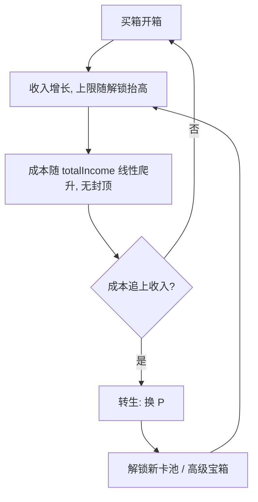

# 卡牌收集游戏 · 经济设计

> 状态：**成本曲线已实现 ✅**；**转生闭环已实现 ✅**（新卡池 + 黄金宝箱 + 手动转生）；**参数已数值校准并应用 ✅**（`PER_POINT` 50000 → 400000，`MAX_LEVEL` 5 → 7，见 §7-§8）。本文档记录「提前通关」问题的诊断与解法演进。

> 校准工具：`tools/balance-sim.mjs`（`node tools/balance-sim.mjs`）。它会先与真实 `CardCollectorGame` 做逐帧一致性校验，再扫描参数。

## 1. 问题诊断

**收入有硬上限，成本有硬封顶，两者错配导致「提前通关」。**

全图鉴满级（19 张卡全部 Lv5）的收入上限：

| 稀有度 | base | Lv5 收入 | 张数 | 小计 |
|---|---|---|---|---|
| common | 1 | 5 | 6 | 30 |
| uncommon | 2 | 10 | 5 | 50 |
| rare | 4 | 20 | 4 | 80 |
| epic | 8 | 40 | 3 | 120 |
| legendary | 20 | 101 | 1 | 101 |
| **合计** | | | 19 | **381/s** |

而宝箱成本被 `COST_CAP = 30` 锁死。集齐图鉴后收入（381/s）永久超过单箱成本，玩家进入「每秒买箱 → 纯刷」的死循环，没有阻力、目标和终局。

## 2. 设计目标

1. **任何时刻「买下一箱」都有边际成本** —— 成本最终必须追上并超过收入上限，制造转生动机。
2. **集齐图鉴（Lv1）仍是早期目标** —— 前期成本增长几乎不影响开箱。
3. **转生提供长期循环** —— 每轮解锁更强内容，收入上限更高，走得更远。

## 3. 成本曲线（已实现 ✅）

```
cost = CHEST_COST + floor(totalIncome / COST_SCALE)
```

- `totalIncome`：累计被动收入（`economy._stats.totalIncome`，已存在，直接复用）。
- 无封顶，线性增长。
- 前期成立：集齐图鉴（19 张）时成本仅 ~13，几乎不卡开箱（实测 43 秒集齐）。

> **⚠️ 后期断言已证伪（实测）**：原文档称「后期收入 381/s 撞上成本墙（每箱要攒 10+ 秒），玩家感到变慢」。
> 实测 `COST_SCALE = 1000` 下这个「墙」要到 **2 小时 47 分**才出现（每箱 10 秒口径），30 秒口径要 **8 小时 20 分**。
> 也就是说成本墙在 30 分钟的一轮里**根本不会触发**，它不是转生的信号——转生实际由 `PER_POINT` 的 P 阈值驱动。
> `COST_SCALE` 的真实作用是对「永不转生」的玩家兜底，不是节奏调节器。

参数：`COST_SCALE = 1000`（兜底墙 ≈ 2h47m）；第一轮时长实际由 `PER_POINT` 决定，见 §7。

## 4. 转生：解锁新内容（已实现 ✅）

转生收益不采用「全局 +% 收入」，而是**解锁新卡池 / 高级宝箱**，与收集主题契合。收入上限的抬高靠「解锁更高 base 的卡」，而非数值系数。

### 4.1 声望 P

```
P_gain = floor(totalIncome / PER_POINT)
```

转生动作（手动触发）：清空收藏、金币、`chestsOpened`、`totalIncome`（成本复位）；保留并累计 `P`。方法 `economy.prestigeReset()` / `game.prestige()`。

### 4.2 解锁表（P 为跨轮次累计值）

| 累计 P | 解锁 |
|---|---|
| 3 | 「神话 Mythic」卡池（base 40，weight 0.6） |
| 5 | 「黄金宝箱」：价格 = 普通箱 ×3，保底 rare+ |
| 10 | 「远古 Ancient」卡池（base 80，weight 0.25） |
| 20 | 「星灵 Astral」卡池（base 150，weight 0.1） |

新解锁的稀有度**混入所有宝箱**的掉落池（`availableRarities`），黄金宝箱用 `goldChestPool`（rare 及以上）。

每轮解锁更强卡 → 收入上限抬高 → 走得更远 → 更多 P → 更多解锁。

### 4.3 交互

- 手动转生按钮 + `KeyP`；转生前 HUD 显示可获声望 `(+N next)`。
- 黄金宝箱按钮 + `KeyG`；未解锁时置灰，显示 `Gold Chest (locked)`。

## 5. 闭环示意



## 6. 参数与校准

| 参数 | 取值 | 说明 |
|---|---|---|
| `COST_SCALE` | 1000 | 每 1000 累计收入，成本 +1；兜底墙 ≈ 2h47m（**不是**节奏调节器） |
| `PER_POINT` | **250000**（已应用） | 转生时每 N 累计收入换 1 P；**第一轮时长的实际控制量** |
| `MAX_LEVEL_BASE` | **5**（已应用） | 未转生时的等级上限 |
| `MAX_LEVEL_PER_PRESTIGE` | **1**（已应用） | **每次转生上限 +1**，见 §9 |
| `LEVEL_GROWTH_RATE` | **1.5**（已应用） | 每级所需反复卡的增速（原为 2），见 §9.1 |
| `GOLD_CHEST_MULTIPLIER` | 3 | 黄金宝箱价格 = 普通箱 ×3 |
| `GOLD_CHEST_AT` | 5 | 解锁黄金宝箱所需累计 P |

> 以上参数已由 `tools/balance-sim.mjs` 校准，实测结果见 §7（时长）、§8（成长期）与 §9（等级上限成长）。

## 7. 数值校准结果（实测）

用 `tools/balance-sim.mjs` 在 6 个种子下模拟，结论高度稳定。**关键发现：节奏由 `PER_POINT` 决定，不是 `COST_SCALE`。**

### 7.1 收入天花板按解锁阶梯（实测）

| 阶段 | 新增 | 上限 | 相对基础 |
|---|---|---|---|
| 基础 5 档 | — | 381/s | 1.00x |
| + Mythic (P3) | +404/s | 785/s | 2.06x |
| + Ancient (P10) | +810/s | 1595/s | 4.19x |
| + Astral (P20) | +1518/s | 3113/s | 8.17x |

每次解锁约**翻倍**，阶梯健康。

### 7.2 死亡时间：收入 2 分 06 秒就封顶

19 张基础卡在 **t=43 秒**集齐，全部练满 Lv5 在 **t=126 秒**（= 2m06s），此后收入锁死 381/s。
第一轮剩下的时间全是「等成本涨」，没有任何 build 决策——这是当前节奏最大的问题：**增长期只占一轮的 7%**（详见 §8.2）。

### 7.3 参数校准

`PER_POINT = 50000`（原值）让第一轮只要 **7m21s** 就能转生，而 `COST_SCALE = 1000` 的墙在 2h47m。两者错配。

| `PER_POINT` | 首次转生 P3 | P10 | P20 |
|---|---|---|---|
| 50000（原值） | 7m21s | 18m10s | 28m35s |
| **200000（已应用）** | **27m02s** | **1h03m** | **1h34m** |

`PER_POINT = 200000` 在 6 个种子下 P3 稳定在 27m00s ± 5s，**命中 §3 的 ~30 分钟目标**，且后续阶梯（27min → 1h03m → 1h34m）平滑。
该改动**不触碰任何收入公式**，只改时间轴，因此不影响 §7.1 的天花板和黄金宝箱性价比，风险最低。

### 7.4 黄金宝箱性价比（已验证合理 ✅）

3 个普通箱 vs 1 个黄金箱（等花费）：

| 累计 P | 神话以上占比（普通箱 / 黄金箱） |
|---|---|
| 0 | 0.00% / 0.00% |
| 5 | 0.60% / 2.65% |
| 20 | 0.94% / 4.14% |

黄金箱把神话以上出货率提升约 **4.4 倍**，考虑升级折算后总价值约为等花费普通箱的 2x。
**黄金宝箱「用于定向获取高级卡」的设计意图成立**，无需调整。

### 7.5 已知设计问题（非参数可解）

- **满级后的重复卡几乎无价值**：`MAXED_DUPLICATE_COIN_MULTIPLIER = 3` 的返还额恒为 `baseIncome × 3`，而满级卡收入是 `baseIncome × 5.0625`，比值在每一档都固定为 **0.593** —— 即一次重复返还只值该卡**约 0.6 秒**的收入（Astral 满级 759/s，返还 450 金币）。图鉴全满后抽卡基本等于空转，跨轮次的长期成长曲线趋平。
- **重复卡稀释进度**：P20 后卡池 25 张、`LEVEL_COPY_THRESHOLDS` 最高 16，抽到特定卡练满的期望抽数很高，后期成长感可能偏慢。

以上需要设计决策（例如提高满级补贴、或加入「满级卡不占用掉落池」机制），不是调参数能解决的。

## 8. 成长期与一轮时长是两个独立问题

§7 把一轮时长校准到了 30 分钟，但**时长 ≠ 手感**：一轮里真正在成长的时间只有开头一小段。

### 8.1 两个独立的数学结论

**(a) 提高收入不会缩短等待。** 成本墙时间 `T = COST_SCALE × (I×W − 10) / I`，当收入 `I` 远大于初价时 `T ≈ COST_SCALE × W`，**与 I 无关**。实测收入 381/s 与 2000/s 的墙都在 ~2h47m。要缩短等待只能降 `COST_SCALE`。

**(b) 降 `COST_SCALE` 有下限。** 降得太狠会让玩家早期买不起箱子、图鉴练不满，收入天花板反而下降（`scale=120` 时天花板从 381 掉到 334）。所以「缩短等待」不能靠无脑降 `scale`。

### 8.2 成长曲线的实测形状

指标定义：**增长停止时刻 = 收入最后一次上升的时间点**。此后玩家仍能开箱，但**任何操作都不会再提高收入**。
该指标**与采样窗口无关**，是判断「一轮里有多少时间在成长」的可靠口径：

| 变体 | 增长停止于 | 收入天花板 | 升级次数 | 增长期占比（/30min） |
|---|---|---|---|---|
| **MAX_LEVEL=5（现状）** | **2m06s** | 381 | 53 | **7.0%** |
| MAX_LEVEL=6 | 7m10s | 568 | 66 | 23.9% |
| MAX_LEVEL=7 | 7m01s | 780 | 79 | 23.4% |
| MAX_LEVEL=8 | 10m24s | 968 | 93 | 34.7% |
| MAX_LEVEL=9 | 24m02s | 1101 | 104 | 80.1% |

现状（`MAX_LEVEL=5`）在 **2 分 06 秒**收入就见顶，而一轮长 27 分钟——**增长期只占 7%**。
`MAX_LEVEL` 是拉长增长期的有效杠杆：等级越高，「练满」需要的重复卡按 `2^(L−1)` 几何增长，成长被摊开。

> **口径提醒**：本工具早期用「相对采样窗口内天花板的 90%」作指标，该值会随窗口长度漂移
> （同一配置在 30min 窗口下是 1m23s、180min 窗口下是 7m01s），不适合跨配置比较。
> 上表的「增长停止时刻」不依赖窗口。另：`playRun` 原用「首次停滞 30 秒」判定封顶，
> 会锁死在轮中某个平台期、忽略之后的升级，导致少报（报 1m23s，实际 2m06s），已修复。

### 8.3 推荐方案：`MAX_LEVEL = 7` + `PER_POINT = 400000`

`MAX_LEVEL` 拉长增长期的同时会抬高收入天花板，转生反而变快，所以必须**联动上调 `PER_POINT`**：

| `MAX_LEVEL` | `PER_POINT` | 首次转生 P3 | 增长停止于 | 增长期占比 |
|---|---|---|---|---|
| 5（现状） | 200000 | 27m02s | 2m06s | **7.0%** |
| **7（推荐）** | **400000** | **27m42s** | **7m01s** | **23.4%** |

推荐配置在 6 个种子下首次转生稳定在 **27m42s ± 13s**，仍命中 §3 的 ~30 分钟目标，
而增长期占比从 **7% 提升到 23%**（约 3.3 倍）。

> 若想更长的成长期可用 `MAX_LEVEL=8`（34.7%），但需把 `PER_POINT` 再上调到约 510000 才能维持一轮 ~30 分钟；
> `MAX_LEVEL=9`（80.1%）几乎整轮都在成长，但练满一张卡需要 `2^8 = 256` 张重复卡，
> 对放置类而言刷取强度可能过重。**`MAX_LEVEL=7` 是「成长显著拉长」与「一轮内仍能企及满级」的平衡点。**

### 8.4 实施说明（已被 §9 取代 ⚠️）

> **本节方案已废弃。** §8 曾把 `MAX_LEVEL` 固定为 7、`PER_POINT` 定为 400000，首轮 27m42s 达标。
> 但固定上限意味着每轮目标完全相同，转生不改变「能走多远」。
> §9 改为**等级上限随转生次数成长**并放缓阈值增速，本节常量已不再适用。
> 保留此节以记录演进：先是「加深固定深度」拉长成长期，再是「让深度本身成长」。

- 当时的改动：`MAX_LEVEL: 5 → 7`，`LEVEL_COPY_THRESHOLDS` 扩展为 `[1,2,4,8,16,32,64]`，
  `PRESTIGE.PER_POINT: 200000 → 400000`。
- 仍然成立的结论：`cardIncome` 收入公式不变，故 §7.1 解锁阶梯与 §7.4 黄金箱结论不受影响。
- 仍然有效的教训：测试不应硬编码满级值——该测试现已改为引用 `levelThresholds()` / `maxLevelAt()`。
- 当时的实测：6 种子首次转生 27m42s ± 13s，增长停止于 7m01s，收入天花板 780/s。

## 9. 等级上限随转生成长（已实现 ✅）

§8 用固定 `MAX_LEVEL` 换来了成长期，但固定上限意味着**每轮的目标完全一样**——转生只重置进度，
不改变「能走多远」。§9 把上限本身变成转生奖励：**每转生一次，等级上限 +1**。

### 9.1 为什么必须同时放缓阈值增速

原阈值是翻倍的（`2^(L-1)`）。上限一旦不封顶，翻倍会爆炸：

| 等级 | 翻倍(×2) 所需反复卡 | 放缓(×1.5) |
|---|---|---|
| Lv7 | 64 | 11 |
| Lv10 | 512 | 38 |
| Lv15 | 16384 | 88 |

Lv10 之后单张卡要上千次抽卡，Lv15 要一万六千张——放置类会退化成纯挂机。
所以 `LEVEL_GROWTH_RATE` 由 **2 → 1.5**，使 Lv15 只需 88 张，长期空间不封顶但始终可企及。

> 副作用需注意：**放缓增速会缩短成长期**（Lv7 从 64 张降到 11 张）。
> 这是「上限成长」与「成长期长度」之间的此消彼长，参数必须联合调，不能单独改一个。

### 9.2 参数联合校准（6 种子实测）

`LEVEL_GROWTH_RATE` 与 `PER_POINT` 联合扫描（`MAX_LEVEL_BASE=5`，`MAX_LEVEL_PER_PRESTIGE=1`）：

| 增速 | `PER_POINT` | 首次转生 P3 |
|---|---|---|
| 1.5 | 200000 | 26m39s |
| **1.5** | **250000** | **33m13s** |
| 1.5 | 300000 | 39m47s |
| 1.6 | 250000 | 33m15s |
| 1.75 | 250000 | 33m19s |

取 **`LEVEL_GROWTH_RATE = 1.5` + `PER_POINT = 250000`**：首轮 33m13s（±4s，6 种子），
仍贴近 §3 的 ~30 分钟目标。选 1.5 而非 1.6/1.75，因为它在长期（Lv15+）保留最多的可企及性。

### 9.3 多轮轨迹（实测）

| 轮次 | 起始 P | 时长 | 成长期 | 等级上限 | 收入天花板 |
|---|---|---|---|---|---|
| 1 | 0 | 33m13s | 0m36s | 6 | 381/s |
| 2 | 3 | 7m58s | 3m51s | 7 | 1174/s |
| 3 | 5 | 13m12s | 5m01s | 8 | 1766/s |
| 4 | 10 | 14m02s | 7m13s | 9 | 3443/s |
| 5 | 20 | 2h51m | 2h23m | 10 | 6836/s |

**等级上限逐轮递增（6→7→8→9→10），成长期随之加深（36s → 3m51s → 5m01s → 7m13s）**——
这正是 §8 遗留的「增长期太短」问题的解：不再靠固定深度的等级表，而是让深度随转生持续生长。

> 注：第 2 轮只有 7m58s，因为玩家在 P3 解锁 Mythic 后收入跳升、`PER_POINT` 相对变「便宜」。
> 这是解锁节奏与转生阈值的固有耦合，属正常现象；后续轮次重新拉长。

### 9.4 实现要点

- `maxLevelAt(prestigeCount)` = `MAX_LEVEL_BASE + MAX_LEVEL_PER_PRESTIGE × prestigeCount`。
- `levelThresholds(prestigeCount)` 生成阈值表；`levelForCopies(copies, prestigeCount)` 取等级。
- **`CardInstance` 固化 `maxLevel`**：卡牌进入收藏时记下当时的 `economy.maxLevel()`。
  一轮内上限不变（转生才 +1，而转生会清空收藏），所以固化后 `card.level` 不依赖外部状态。
- `economy.prestigeCount` 与 `economy.maxLevel` 已加入 `getState()` 与 `mechanic_contract.json`。
- HUD 显示 `Lv cap N`，转生按钮显示 `Prestige (+N) → LvM`——**上限成长是转生的主要收益，必须可见**。
- 收藏列表显示 `Lv3/7`，让玩家看到距满级还有多远。

### 9.5 对既有存档的影响

`prestigeCount` 是新增字段，旧存档缺失时默认 0 → 上限 = `MAX_LEVEL_BASE` = 5，
与旧行为的 Lv5 上限一致（但阈值增速由 ×2 变 ×1.5，Lv5 需求从 16 张降为 5 张，进度只会更快）。
无破坏性。
