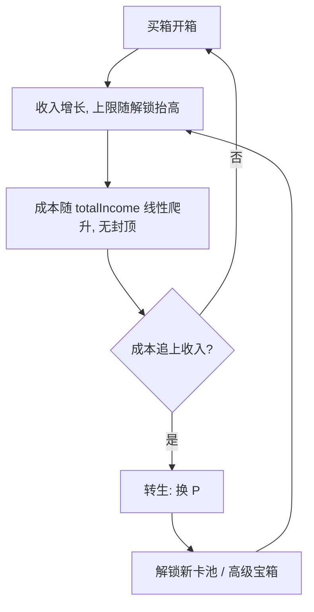

# 卡牌收集游戏 · 经济设计

> 状态：**成本曲线已实现 ✅**；**转生闭环已实现 ✅**（新卡池 + 黄金宝箱 + 手动转生）；**参数已数值校准并应用 ✅**（见 §7，`PER_POINT` 已由 50000 调整为 200000）。本文档记录「提前通关」问题的诊断与解法演进。

> 校准工具：`tools/balance-sim.mjs`（`node tools/balance-sim.mjs`）。它会先与真实 `CardCollectorGame` 做逐帧一致性校验，再扫描参数。

## 1. 问题诊断

**收入有硬上限，成本有硬封顶，两者错配导致「提前通关」。**

全图鉴满级（19 张卡全部 Lv5）的收入上限：

| 稀有度 | base | Lv5 收入 | 张数 | 小计 |
|---|---|---|---|---|
| common | 1 | 5 | 6 | 30 |
| uncommon | 2 | 10 | 5 | 50 |
| rare | 4 | 20 | 4 | 80 |
| epic | 8 | 40 | 3 | 120 |
| legendary | 20 | 101 | 1 | 101 |
| **合计** | | | 19 | **381/s** |

而宝箱成本被 `COST_CAP = 30` 锁死。集齐图鉴后收入（381/s）永久超过单箱成本，玩家进入「每秒买箱 → 纯刷」的死循环，没有阻力、目标和终局。

## 2. 设计目标

1. **任何时刻「买下一箱」都有边际成本** —— 成本最终必须追上并超过收入上限，制造转生动机。
2. **集齐图鉴（Lv1）仍是早期目标** —— 前期成本增长几乎不影响开箱。
3. **转生提供长期循环** —— 每轮解锁更强内容，收入上限更高，走得更远。

## 3. 成本曲线（已实现 ✅）

```
cost = CHEST_COST + floor(totalIncome / COST_SCALE)
```

- `totalIncome`：累计被动收入（`economy._stats.totalIncome`，已存在，直接复用）。
- 无封顶，线性增长。
- 前期成立：集齐图鉴（19 张）时成本仅 ~13，几乎不卡开箱（实测 43 秒集齐）。

> **⚠️ 后期断言已证伪（实测）**：原文档称「后期收入 381/s 撞上成本墙（每箱要攒 10+ 秒），玩家感到变慢」。
> 实测 `COST_SCALE = 1000` 下这个「墙」要到 **2 小时 47 分**才出现（每箱 10 秒口径），30 秒口径要 **8 小时 20 分**。
> 也就是说成本墙在 30 分钟的一轮里**根本不会触发**，它不是转生的信号——转生实际由 `PER_POINT` 的 P 阈值驱动。
> `COST_SCALE` 的真实作用是对「永不转生」的玩家兜底，不是节奏调节器。

参数：`COST_SCALE = 1000`（兜底墙 ≈ 2h47m）；第一轮时长实际由 `PER_POINT` 决定，见 §7。

## 4. 转生：解锁新内容（已实现 ✅）

转生收益不采用「全局 +% 收入」，而是**解锁新卡池 / 高级宝箱**，与收集主题契合。收入上限的抬高靠「解锁更高 base 的卡」，而非数值系数。

### 4.1 声望 P

```
P_gain = floor(totalIncome / PER_POINT)
```

转生动作（手动触发）：清空收藏、金币、`chestsOpened`、`totalIncome`（成本复位）；保留并累计 `P`。方法 `economy.prestigeReset()` / `game.prestige()`。

### 4.2 解锁表（P 为跨轮次累计值）

| 累计 P | 解锁 |
|---|---|
| 3 | 「神话 Mythic」卡池（base 40，weight 0.6） |
| 5 | 「黄金宝箱」：价格 = 普通箱 ×3，保底 rare+ |
| 10 | 「远古 Ancient」卡池（base 80，weight 0.25） |
| 20 | 「星灵 Astral」卡池（base 150，weight 0.1） |

新解锁的稀有度**混入所有宝箱**的掉落池（`availableRarities`），黄金宝箱用 `goldChestPool`（rare 及以上）。

每轮解锁更强卡 → 收入上限抬高 → 走得更远 → 更多 P → 更多解锁。

### 4.3 交互

- 手动转生按钮 + `KeyP`；转生前 HUD 显示可获声望 `(+N next)`。
- 黄金宝箱按钮 + `KeyG`；未解锁时置灰，显示 `Gold Chest (locked)`。

## 5. 闭环示意



## 6. 参数与校准

| 参数 | 取值 | 说明 |
|---|---|---|
| `COST_SCALE` | 1000 | 每 1000 累计收入，成本 +1；兜底墙 ≈ 2h47m（**不是**节奏调节器） |
| `PER_POINT` | **200000**（已应用） | 转生时每 N 累计收入换 1 P；**这才是第一轮时长的实际控制量** |
| `GOLD_CHEST_MULTIPLIER` | 3 | 黄金宝箱价格 = 普通箱 ×3 |
| `GOLD_CHEST_AT` | 5 | 解锁黄金宝箱所需累计 P |

> 以上参数已由 `tools/balance-sim.mjs` 校准，实测结果见 §7。

## 7. 数值校准结果（实测）

用 `tools/balance-sim.mjs` 在 6 个种子下模拟，结论高度稳定。**关键发现：节奏由 `PER_POINT` 决定，不是 `COST_SCALE`。**

### 7.1 收入天花板按解锁阶梯（实测）

| 阶段 | 新增 | 上限 | 相对基础 |
|---|---|---|---|
| 基础 5 档 | — | 381/s | 1.00x |
| + Mythic (P3) | +404/s | 785/s | 2.06x |
| + Ancient (P10) | +810/s | 1595/s | 4.19x |
| + Astral (P20) | +1518/s | 3113/s | 8.17x |

每次解锁约**翻倍**，阶梯健康。

### 7.2 死亡时间：收入 1 分 23 秒就封顶

19 张基础卡在 **t=43 秒**集齐，全部练满 Lv5 在 **t=126 秒**，此后收入锁死 381/s。
第一轮剩下的时间全是「等成本涨」，没有任何 build 决策——这是当前节奏最大的问题：**增长期只占一轮的 ~5%**。

### 7.3 参数校准

`PER_POINT = 50000`（原值）让第一轮只要 **7m21s** 就能转生，而 `COST_SCALE = 1000` 的墙在 2h47m。两者错配。

| `PER_POINT` | 首次转生 P3 | P10 | P20 |
|---|---|---|---|
| 50000（原值） | 7m21s | 18m10s | 28m35s |
| **200000（已应用）** | **27m02s** | **1h03m** | **1h34m** |

`PER_POINT = 200000` 在 6 个种子下 P3 稳定在 27m00s ± 5s，**命中 §3 的 ~30 分钟目标**，且后续阶梯（27min → 1h03m → 1h34m）平滑。
该改动**不触碰任何收入公式**，只改时间轴，因此不影响 §7.1 的天花板和黄金宝箱性价比，风险最低。

### 7.4 黄金宝箱性价比（已验证合理 ✅）

3 个普通箱 vs 1 个黄金箱（等花费）：

| 累计 P | 神话以上占比（普通箱 / 黄金箱） |
|---|---|
| 0 | 0.00% / 0.00% |
| 5 | 0.60% / 2.65% |
| 20 | 0.94% / 4.14% |

黄金箱把神话以上出货率提升约 **4.4 倍**，考虑升级折算后总价值约为等花费普通箱的 2x。
**黄金宝箱「用于定向获取高级卡」的设计意图成立**，无需调整。

### 7.5 已知设计问题（非参数可解）

- **满级后的重复卡几乎无价值**：`MAXED_DUPLICATE_COIN_MULTIPLIER = 3` 的返还额恒为 `baseIncome × 3`，而满级卡收入是 `baseIncome × 5.0625`，比值在每一档都固定为 **0.593** —— 即一次重复返还只值该卡**约 0.6 秒**的收入（Astral 满级 759/s，返还 450 金币）。图鉴全满后抽卡基本等于空转，跨轮次的长期成长曲线趋平。
- **重复卡稀释进度**：P20 后卡池 25 张、`LEVEL_COPY_THRESHOLDS` 最高 16，抽到特定卡练满的期望抽数很高，后期成长感可能偏慢。

以上需要设计决策（例如提高满级补贴、或加入「满级卡不占用掉落池」机制），不是调参数能解决的。
