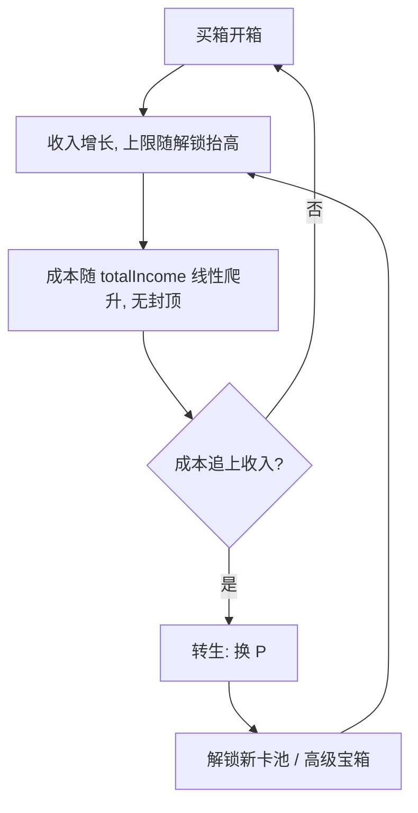

# 卡牌收集游戏 · 经济设计

> 状态：**成本曲线已实现**；**转生为设计存档，尚未落地**。本文档记录「提前通关」问题的诊断与解法演进。

## 1. 问题诊断

**收入有硬上限，成本有硬封顶，两者错配导致「提前通关」。**

全图鉴满级（19 张卡全部 Lv5）的收入上限：

| 稀有度 | base | Lv5 收入 | 张数 | 小计 |
|---|---|---|---|---|
| common | 1 | 5 | 6 | 30 |
| uncommon | 2 | 10 | 5 | 50 |
| rare | 4 | 20 | 4 | 80 |
| epic | 8 | 40 | 3 | 120 |
| legendary | 20 | 101 | 1 | 101 |
| **合计** | | | 19 | **381/s** |

而宝箱成本被 `COST_CAP = 30` 锁死。集齐图鉴后收入（381/s）永久超过单箱成本，玩家进入「每秒买箱 → 纯刷」的死循环，没有阻力、目标和终局。

## 2. 设计目标

1. **任何时刻「买下一箱」都有边际成本** —— 成本最终必须追上并超过收入上限，制造转生动机。
2. **集齐图鉴（Lv1）仍是早期目标** —— 前期成本增长几乎不影响开箱。
3. **转生提供长期循环** —— 每轮解锁更强内容，收入上限更高，走得更远。

## 3. 成本曲线（已实现 ✅）

```
cost = CHEST_COST + floor(totalIncome / COST_SCALE)
```

- `totalIncome`：累计被动收入（`economy._stats.totalIncome`，已存在，直接复用）。
- 无封顶，线性增长。
- 两端都成立：前期 total 涨得慢、成本几乎不变（开 100 箱集齐图鉴时成本才 ~12，不卡图鉴）；后期收入 381/s 撞上成本墙（每箱要攒 10+ 秒），玩家感到「变慢了」——这是转生的信号。

参数：`COST_SCALE = 1000`，目标第一轮 **~30 分钟**。

## 4. 转生：解锁新内容（待实现 ⏳）

转生收益不采用「全局 +% 收入」，而是**解锁新卡池 / 高级宝箱**，与收集主题契合。收入上限的抬高靠「解锁更高 base 的卡」，而非数值系数。

### 4.1 声望 P

```
P_gain = floor(totalIncome / PRESTIGE_PER_POINT)
```

转生动作：清空收藏、金币、`chestsOpened`（成本复位）、`totalIncome`；保留并累计 `P`。

### 4.2 解锁表（P 为跨轮次累计值）

| 累计 P | 解锁 |
|---|---|
| 3 | 「神话 Mythic」卡池（base 40） |
| 5 | 「黄金宝箱」：更贵，保底 rare+ 或抬权重 |
| 10 | 「远古 Ancient」卡池（base 80） |
| 20 | 「星灵 Astral」卡池（base 150） |

每轮解锁更强卡 → 收入上限抬高 → 走得更远 → 更多 P → 更多解锁。

### 4.3 待定参数

- `PRESTIGE_PER_POINT = 50000`（第一轮 ~30 分钟 → P ≈ 7，够解锁第一个卡池）。
- 转生触发点：当「买下一箱」的边际时间超过阈值（如 15 秒），玩家自然想转生。

## 5. 闭环示意



## 6. 参数与校准

| 参数 | 取值 | 说明 |
|---|---|---|
| `COST_SCALE` | 1000 | 每 1000 累计收入，成本 +1；~30 分钟一轮 |
| `PRESTIGE_PER_POINT` | 50000 | 转生时每 50000 累计收入换 1 P（待实现） |

> 以上参数均为估算，最终需靠 playtest 校准节奏。
