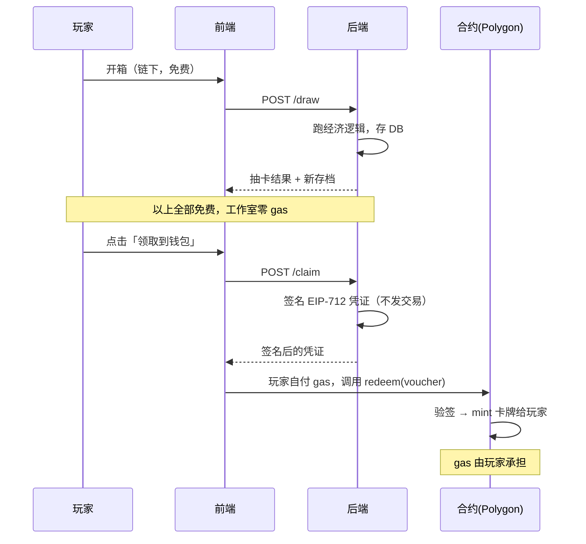
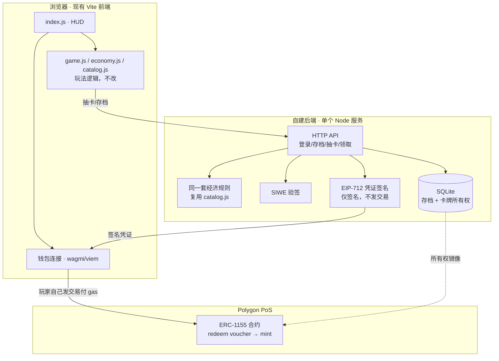
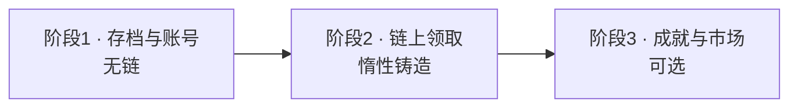

# Web3 集成方案（最小 & 最省钱）

> 目标：把现有的卡牌收集游戏与 web3 结合，**链上记录卡牌所有权**，玩法保持链下。
> 本文给出最小可行方案与最省钱的实现路径，含真实成本估算。
>
> 状态：**阶段 1 与阶段 2 均已实施 ✅** —— 后端存档 + SIWE 登录 + 服务端裁决抽卡
> （[`../server/`](../server/README.md)）、ERC-1155 惰性铸造 + 凭证签发 + 前端领取
> （[`../contracts/`](../contracts/README.md)）。端到端已在真实本地链上验证通过。
> 本文最初写作时游戏**没有任何存档**（见 §1.1），该前置问题已在阶段 1 解决。

## 0. 结论先行

| 问题 | 答案 |
|---|---|
| **最小可行版本是什么** | 钱包登录（SIWE）→ 链下存档 → **玩家主动「领取」时才上链**（惰性铸造） |
| **最省钱的点在哪** | **惰性铸造**：工作室的链上成本 **≈ $0**，gas 由玩家在领取时自付 |
| **选哪条链** | **Polygon PoS**（最低，约 $0.001–0.01/次）；若要真正的 rollup 安全性则选 **Base** |
| **首年现金成本** | **最低约 $15**（仅域名）；含自建后端约 **$70–85** |
| **最大的工作量** | **不是链，是存档系统**。游戏现在刷新即清零，后端与存档才是主体工程 |

**核心判断**：这个游戏做 web3 的最大成本不在链上，而在「让游戏首次拥有持久化状态」。
链上部分反而简单——因为卡牌是程序化生成的，没有图片资源要存。

## 1. 现状约束（决定了方案形态）

### 1.1 游戏没有任何存档

全代码库 grep `localStorage` / `save` / `persist` / `indexedDB` **零命中**。
所有状态（`coins`、`cards`、`prestige`、`totalIncome`）都在 `CardCollectionEconomy` 的内存里，
刷新页面即从零开始。

**这直接决定了**：任何「玩家拥有资产」的 web3 设计都**必须先有存档**，否则链上卡片的主人无从谈起。
§7 的分阶段里，存档是第一优先级，不是链。

### 1.2 卡牌是程序化生成的，没有图片资源

卡面是 `name + rarity + level` 渲染出来的（`renderer.js`），`catalog.js` 里 `CARD_POOL` 是纯字符串数组，
**不存在 PNG/GLB 等外部资源**。

**这带来两个省钱优势**：
- 不需要为每张卡上传图片到 IPFS（省存储与带宽）
- 元数据可以用 data URI 或后端一个接口动态生成，**零额外存储成本**

### 1.3 纯前端，无后端、无账号

Vite + three.js，只有 `@a3game/playable` 和 `three` 两个依赖。没有服务器、没有数据库、没有用户体系。

### 1.4 已实现的经济系统（web3 需与之对齐）

| 概念 | 现状 | 上链映射建议 |
|---|---|---|
| 卡牌身份 | `CARD_POOL` 的 19+ 个名字 | **tokenId**（不可变） |
| 稀有度 | 8 档，`RARITY_PROFILE` | tokenId 的元数据属性（不可变） |
| 副本数 | `CardInstance.copies` | **ERC-1155 的 balance**（天然对应） |
| 等级 | 由副本数推导（Lv1–LvN） | **不上链**（见 §2.3） |
| 转生 P | 跨轮次累计 | 建议上链为「成就/徽章」，见 §2.4 |

## 2. 核心设计：为什么这样最省钱

### 2.1 惰性铸造（Lazy Minting）——省钱的关键

**不要在玩家抽到卡时立即上链。** 那意味着工作室为每一次抽卡付 gas。
一轮游戏有约 665 次开箱（见 `../DESIGN.md` §10），一个玩家玩几轮就是几千次交易。

改为：**后端用 EIP-712 签一张「凭证」，玩家想要真正持有时才自己付 gas 上链**。



**效果**：工作室链上成本 ≈ $0。只有玩家主动领取时才产生 gas，且由玩家支付。

### 2.2 ERC-1155 的 balance ≡ 游戏的副本数

这是本方案最优雅的一点，**不需要引入任何新概念**：

```
tokenId  = 卡牌身份（如 "Slime"）      → 不可变，全服共用
balance  = 玩家持有该卡的副本数        → 游戏里就是 copies
```

游戏里「抽到重复卡 → 副本数 +1」，**恰好等于 ERC-1155 的 `balanceOf` 增加 1**。
无需把每张卡铸成独立 NFT（那是 ERC-721 的做法，成本高一个数量级）。

### 2.3 等级不上链——避免状态更新

等级由副本数推导（`levelForCopies`），**如果把等级写进链上元数据**，每次升级都要发交易改状态，
`COST_SCALE=100` 下一轮约 665 次开箱、上千次升级，gas 成本不可接受。

因此：**链上只存 tokenId 与 balance，等级在链下计算**。前端展示时用同一套 `catalog.js` 规则推导。
`tokenURI` 返回的元数据里可以**动态**带上当前等级（由后端读取），但**不发链上交易**。

### 2.4 转生与链上卡的冲突（需明确取舍）

游戏的转生会**清空收藏**（`prestigeReset()`）并抬高等级上限。但链上资产**不能被游戏单方面销毁**。

**建议**：
- **转生保持链下语义**——它重置的是「本轮进度」，不是「玩家资产」
- 链上卡片视为**跨轮的持久收藏**，转生后依然在钱包里
- 转生的累计 P 可铸造为**不可交易的成就徽章**（可选，见 §7 阶段 3）

这样既保住游戏经济（转生的重置感），又满足 web3 的「资产不可被没收」预期。
**这是一处需要与策划确认的设计决策**，两种语义不能同时成立。

## 3. 架构



**要点**：`catalog.js` / `economy.js` **一行都不用改玩法语义**，后端直接复用它跑同一套规则
（模块本来就与 three.js 解耦，这是 `README.md` 里强调的架构优势，此处正好兑现）。
唯一的新增是「把结果持久化」与「按需签名上链」。

## 4. 链与合约选型

### 4.1 链的选择

| 链 | 单次 mint 成本 | 类型 | 适合度 |
|---|---|---|---|
| **Polygon PoS** | $0.001–0.01 | 侧链（安全性与以太坊独立） | **最省钱首选** |
| **Base** | $0.001–0.05 | 真 L2 rollup | **要安全性首选**，Coinbase 生态 |
| Arbitrum | $0.03–0.20 | 真 L2 rollup | 偏贵，适合高价值资产 |
| Ethereum L1 | $20–100 | L1 | **不适用**，单次 mint 就超全年预算 |

**建议：Polygon PoS**。理由：这是低成本收藏类游戏，单卡价值低、频次高，省下的 gas 比多出的
安全性假设更值钱。若后续需要「以太坊级安全性」或 Coinbase 导流，迁移到 Base 的成本不高
（合约代码通用，只是重新部署 + 元数据里的 chainId 改掉）。

> 注意：Polygon PoS 是侧链而非 rollup，不继承以太坊完整安全保证。若卡牌有真实交易价值，应选 Base。

### 4.2 合约最小化设计

一个合约就够，**不要一开始就写复杂逻辑**：

```solidity
// 示意，非最终代码
contract CardCollector is ERC1155 {
    address public signer;                    // 后端的签名地址
    mapping(uint256 => bool) public used;     // 凭证防重放

    function redeem(uint256 tokenId, uint256 amount, uint256 nonce,
                    bytes calldata sig) external {
        require(!used[nonce], "used");
        require(verify(keccak256(tokenId, amount, msg.sender, nonce), sig), "bad sig");
        used[nonce] = true;
        _mint(msg.sender, tokenId, amount, "");
    }

    // 转生成就徽章（阶段 3 再启用）
    function mintPrestige(address to, uint256 points) external { ... }
}
```

**关键点**：
- `used[nonce]` 防重放——否则同一张凭证可无限铸造
- 签名里必须含 `msg.sender`——否则凭证可被他人抢用
- **不做**：版税（ERC-2981）、市场、白名单，初期都不需要

## 5. 后端最小实现

用**一个 Node 服务 + SQLite** 即可，不需要微服务、不需要 Redis、不需要消息队列。

```
server/
├── index.js          # HTTP 服务（Fastify 或 Express）
├── auth.js           # SIWE：验签 + 发 session token
├── save.js           # 存档读写（SQLite）
├── game-api.js       # 复用 catalog.js/economy.js 跑规则
├── voucher.js        # EIP-712 签名
└── db.sqlite         # 单文件数据库
```

**表结构（最小）**：

```sql
CREATE TABLE players (
  address     TEXT PRIMARY KEY,     -- 钱包地址即账号
  save        TEXT NOT NULL,        -- 游戏存档 JSON
  created_at  INTEGER NOT NULL
);

CREATE TABLE chain_claims (
  nonce       INTEGER PRIMARY KEY,  -- 防重放，与合约一致
  address     TEXT NOT NULL,
  token_id    INTEGER NOT NULL,
  amount      INTEGER NOT NULL,
  redeemed    INTEGER DEFAULT 0     -- 是否已上链
);
```

**为什么够用**：
- 钱包地址天然是唯一账号，**不需要注册/密码/邮箱系统**（省一整个模块）
- SQLite 单文件，无需数据库服务
- 存档存 JSON 即可，无需关系化（游戏状态本身就是一棵简单对象树）

**反作弊**：由于抽卡在后端执行，玩家无法伪造结果——这是把逻辑放后端的主要收益。
但 RNG 必须用**服务端种子**，绝不能沿用现在前端可预测的 `createSeededRandom`。

## 6. 成本明细

> 以下为**估算**，gas 价格随市场波动，按 2026-09 量级给出。所有数字需在实施前复核。

### 一次性

| 项目 | 成本 |
|---|---|
| ERC-1155 合约部署（约 2M gas） | **$0.02–0.50**（Polygon/Base） |
| 域名 | $10–15/年（可选，也可用平台子域） |
| 合约审计 | **初期不做**（真实审计 $10k+，与「最省钱」冲突） |

### 持续

| 项目 | 成本 |
|---|---|
| 服务器（1 vCPU / 1GB VPS） | $0–5/月（Fly.io / Railway 免费额度可覆盖早期） |
| 数据库 | **$0**（SQLite 与应用同机） |
| RPC 节点（Alchemy/Infura 免费层） | **$0**（早期远低于免费额度） |
| 存储（元数据动态生成，无图片） | **$0** |

### 每玩家动作

| 动作 | 工作室成本 | 玩家成本 |
|---|---|---|
| 开箱 / 升级 / 转生（链下） | $0 | $0 |
| 领取卡片上链（惰性铸造） | **$0**（只签名，不发交易） | **$0.001–0.01** |

### 首年总成本

| 方案 | 金额 |
|---|---|
| **最低**（免费额度 + 平台子域） | **≈ $0–1**（仅合约部署 gas） |
| **现实**（$5/月 VPS + 域名） | **≈ $70–85** |

**对比**：若不用惰性铸造、每次抽卡都上链，按 665 次/轮 × 1000 玩家，
约 66.5 万次 mint × $0.003 ≈ **$2000**，且随玩家数线性增长。
惰性铸造把这项压到 **$0**。

## 7. 分阶段实施



### 阶段 1：存档与钱包账号（**已实施 ✅**）

| 内容 | 说明 | 状态 |
|---|---|---|
| 后端骨架 | 单 Node 服务 + SQLite | ✅ `server/src/server.js` |
| SIWE 登录 | 钱包签名登录，地址即账号 | ✅ `server/src/auth.js` |
| 存档读写 | 存档 JSON 存库，按地址持久化 | ✅ `server/src/store.js` |
| 抽卡移到后端 | 复用游戏规则，改用加密随机源 | ✅ `server/src/game-service.js`、`rng.js` |
| 游戏包序列化 | `toJSON` / `fromJSON`，兼容旧存档 | ✅ `packages/card-collector/src/economy.js` |
| headless 入口 | 拆分出 `@a3game/card-collector/rules` | ✅ `packages/card-collector/src/rules.js` |
| **链上交互** | **无** | — |
| 前端接入 | 游戏前端连上该服务 | ✅ `session.js` / `api-client.js` / `wallet.js` |

**此阶段结束**：玩家换设备能继续玩，数据不丢。**这已经是一个真实产品的必备能力**，
且完全不涉及链。**建议先独立交付并上线**，验证留存后再进阶段 2。

**实施中发现的额外收益**：抽卡从客户端移到服务端后，原本「种子来自前端、可预测」
的作弊面被同时消除——这是把逻辑放后端的附带结果，见 `server/README.md`。

**成本**：$0–5/月（实测零配置可跑，SQLite 单文件）。

#### 前端的双模式设计

前端**不强制连接**。未连接钱包时保持原有的纯本地玩法（不依赖服务器，demo 与现有
playtest 仍可直接跑）；连接后切换为服务端权威会话。两种模式接口一致，调用方无需分支。

这个选择避免了「为了上线后端而让游戏在无服务器时不可玩」，也让阶段 1 可以独立交付。

端到端已验证：真实钱包签名登录 → 抽卡 → **另一客户端持同一 token 能看到同一存档**。

### 阶段 2：链上所有权（惰性铸造）—— 合约与签发已实施 ✅

| 内容 | 说明 | 状态 |
|---|---|---|
| ERC-1155 合约 | 惰性铸造、EIP-712 凭证、域分隔 | ✅ `contracts/CardCollector.sol` |
| 合约测试 | 25 个用例，**真实 EVM 执行** | ✅ `contracts/test/` |
| 后端签发凭证 | 只签名不发交易 | ✅ `server/src/voucher.js` |
| 领取接口 | `/chain/claimable`、`/chain/vouchers`、`/chain/claimed` | ✅ `server/src/routes.js` |
| 部署脚本 | 打印服务端所需变量 | ✅ `contracts/scripts/deploy.cjs` |
| 前端领取 UI | 切链、发送交易、显示可领取量 | ✅ `packages/card-collector/src/{wallet,session}.js` |
| 领取状态同步 | `chain_claims` 表 | ✅ `server/src/store.js` |
| 端到端验证 | 真实链上铸造并对账 | ✅ `tools/chain-e2e.mjs` |

**ABI 编码放在服务端**：`redeem` 接收 tuple + 动态 `bytes`，手写编码极易产生
「看起来合法但被合约拒绝」的交易。服务端已有 viem 且持有合约地址，直接返回
`transaction.data`，浏览器只负责 `eth_sendTransaction`。编码逻辑因此只存在一处。

**实施中的关键发现**：nonce 原本用 `Math.floor(Date.now()/1000)`，导致同一批
凭证共享同一秒的 nonce，玩家「一次领取全部卡牌」只能成功第一张。已改为 256 位随机数，
并由集成测试锁住。这类问题**只有跨边界测试能发现**——合约测试用 ethers 自己签名，
服务端测试只验证自身自洽。

**成本**：合约部署实测 **1,932,102 gas**（约 $0.02–0.5），之后每玩家领取由玩家自付。

### 阶段 3（可选，明确推迟）

- 转生成就徽章（不可交易，纯荣誉）
- 二级市场（**监管风险最高，见 §8，建议长期不做**）
- 跨游戏卡牌互通

## 8. 风险与合规

| 风险 | 说明 | 建议 |
|---|---|---|
| **监管（最重要）** | 中国大陆对 NFT 二级交易持限制态度；带金融属性的代币可能触及证券法规 | **不做平台币、不做二级市场、不做承诺收益**。只做「收藏品所有权」 |
| 资产保值预期 | 玩家会期待卡片能卖钱，若不能会失望 | 上线前**明确说明**是收藏品而非投资品 |
| 私钥丢失 | 玩家丢钱包即丢资产 | 支持多钱包 + 明确的风险提示 |
| 签名密钥泄露 | 后端签名密钥泄露 = 可无限铸造 | 密钥放 KMS/环境变量，**绝不进代码库**；`used[nonce]` 防重放 |
| 链拥堵 | gas 飙升时玩家领取成本上升 | 惰性铸造对此**天然免疫**（工作室不付 gas） |
| 合约漏洞 | 无审计上线有被攻击风险 | 初期只做 mint、**不托管资金**，损失面有限 |

## 9. 明确不做（省钱的关键）

以下每一项都是常见的「想当然要做」，但会显著增加成本，且非必要：

| 不做 | 省下什么 |
|---|---|
| **平台代币 / 游戏币** | 避免证券合规风险与做市成本 |
| **二级市场 / 交易功能** | 避免最高一档的监管风险与开发量 |
| **每张卡上传 IPFS 图片** | 卡是程序化生成的，**根本没有图片**；元数据动态生成 |
| **ERC-721 每卡一 NFT** | ERC-1155 的 balance 天然对应副本数，gas 低一个数量级 |
| **等级/状态上链** | 避免每次升级发交易 |
| **合约审计（初期）** | 仅在 mint、不托管资金，损失面可控；有资金后再做 |
| **自建 RPC 节点** | 免费层足够，自建需数百美元/月 |

## 10. 待确认的决策点

实施前需产品/策划确认：

1. **转生是否销毁链上卡？**（§2.4）——建议「否」，链上卡跨轮持久
2. **链的选择**——Polygon（最省）vs Base（更安全），建议先 Polygon
3. **是否允许玩家之间转让**——若允许，需考虑监管与市场设计；建议初期**不允许**
4. **卡片上限**——`CARD_POOL` 目前共 **25 张**卡名（基础 19 张 + 转生解锁 6 张），
   即 tokenId 空间天然是 25。总量是否封顶影响 tokenId 设计（建议直接用 0–24 的固定编号，
   与卡名一一对应，**不可增发**——这本身就是「限量」的卖点）

---

## 附：与现有代码的衔接点

| 现有文件 | 阶段 1 实际改动 | 阶段 2 待做 |
|---|---|---|
| `catalog.js` | **未改**（后端直接复用） | 新增 tokenId ↔ 卡名映射 |
| `economy.js` | 加 `toJSON`/`fromJSON`（**玩法规则未动**） | 新增「已领取」标记 |
| `game.js` | 加 `random` 注入点（**默认行为不变**） | 新增 `claimToWallet()` |
| `index.js` | 导出面补充（`PRESTIGE`/`maxLevelAt` 等） | 新增钱包连接与领取按钮 |
| `renderer.js` | **未改** | **未改** |
| 新增 `rules.js` | headless 入口，供服务端使用 | — |
| 新增 `server/` | 全部（19 个测试） | 增加 `/claim` 与签名模块 |

**注意**：现有的 `createSeededRandom` 是**确定性的、可预测的**（种子来自前端参数）。
移到后端后必须换成加密安全的随机源，否则玩家可预测抽卡结果。
